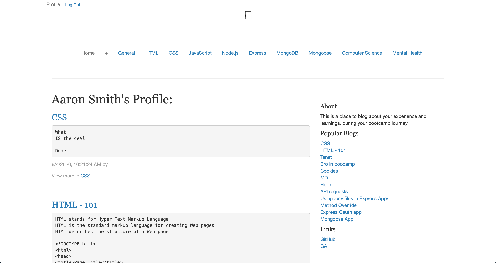

# Bootcamp Blog App - LAB

Bootcamps can be tough, and they definitely move quicly. LAB is a place to post about your personal experience and also tools and tricks you learned while on your bootcamp journey.

## Screenshots

## Technologies Used

- NodeJS
- ExpressJS
- MongoDB
- MongoDB Atlas
- Mongoose
- EJS
- CSS
- Heroku

## Getting Started

Here's the deployed app:
[Click here](https://boocamp-experience.herokuapp.com/) 
Here's the trello board:
[Click here](https://boocamp-blog.herokuapp.com/) 

## Navigation

## Next Steps
